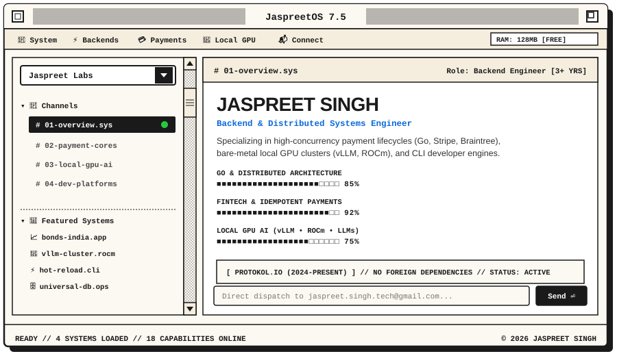
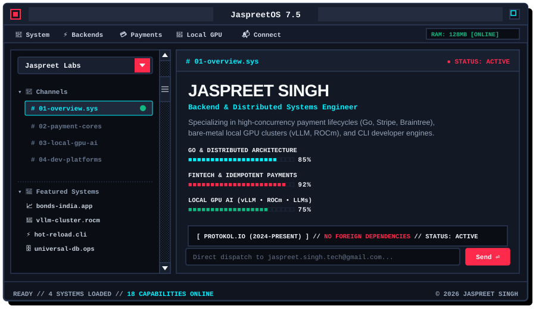

  <!-- Interactive Retro Workstation Theme Switcher (Click to Toggle) -->
  

    
  

  <!-- Theme 1: Vintage Mac System 7 (Light Mode) -->
  

    
<b>☀️ [CLICK TO DISPLAY: VINTAGE MAC OS SYSTEM 7 — LIGHT THEME]</b>

     
    
  

   

  <!-- Theme 2: Cyber Retro Obsidian (Dark Mode) -->
  

    
<b>🌙 [CLICK TO DISPLAY: CYBER RETRO OBSIDIAN — DARK THEME]</b>

     
    
  

   

  <!-- Retro High-Contrast Action Buttons -->
  

    
    &nbsp;
    
    &nbsp;
    
    &nbsp;
    
  

 

### ⚡ Core Engineering Pillars

  <!-- Visual 4-Pillar Infographic Dashboard -->
  

 

### 🛰️ Live Architecture Pipelines

  <!-- Visual End-to-End Architecture Pipelines -->
  

 

---

### 🛠️ Technical Arsenal & Tools

  <!-- Visual Tech Stack Icon Matrix -->
  

 

---

### 🚀 Production Systems & Projects

<table>
  <tr>
    <td width="50%" valign="top">
      <h4>📈 Bonds India Analytics Engine</h4>
      

        
      

      
<b>Real-time corporate debt analytics across NSE &amp; BSE.</b> Aggregated query pipelines computing risk metrics and yield curves with dynamic schema normalization.

      
<code>React 19</code> <code>TypeScript</code> <code>Node.js</code> <code>MongoDB</code> <code>Docker</code>

    </td>
    <td width="50%" valign="top">
      <h4>🧠 Bare-Metal Local GPU Inference</h4>
      

        
      

      
<b>Private local AI cluster with sub-second streaming inference.</b> Continuous batching on AMD ROCm with custom FastAPI streaming proxies for minimum TTFT.

      
<code>vLLM</code> <code>llama.cpp</code> <code>Docker</code> <code>ROCm</code> <code>Python</code>

    </td>
  </tr>
  <tr>
    <td width="50%" valign="top">
      <h4>⚡ CLI Hot-Reload Dev Engine</h4>
      

        
      

      
<b>Terminal-first file watcher slashing rebuild cycles by &gt; 70%.</b> WebSocket-based incremental dispatch engine replacing heavy sync bottlenecks across 15+ engineers.

      
<code>Node.js</code> <code>WebSockets</code> <code>Commander.js</code> <code>TypeScript</code>

    </td>
    <td width="50%" valign="top">
      <h4>🗄️ Universal Database Admin Suite</h4>
      

        
      

      
<b>Database-agnostic operations cockpit handling 10k+ virtualized rows.</b> 50+ pre-built dynamic queries across MongoDB and SQL with mutation safety guards.

      
<code>React</code> <code>TanStack Table</code> <code>Shadcn UI</code> <code>Express</code>

    </td>
  </tr>
</table>

 

---

### 📬 Direct Dispatch & Connect

  
Available for backend systems engineering, distributed payment lifecycles, and high-performance developer tooling.

  

    
    &nbsp;
    
    &nbsp;
    
  

   

  &copy; 2026 Jaspreet Singh &bull; Hosted on GitHub &bull; JaspreetOS 7.5 Active

