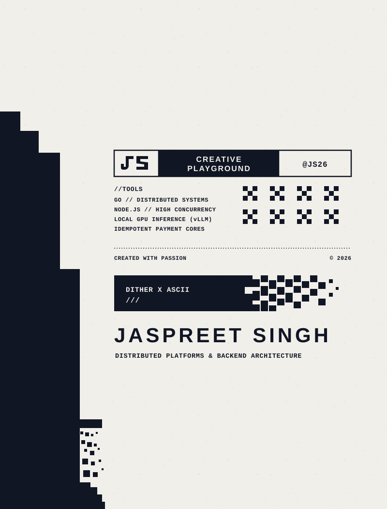
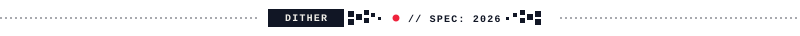
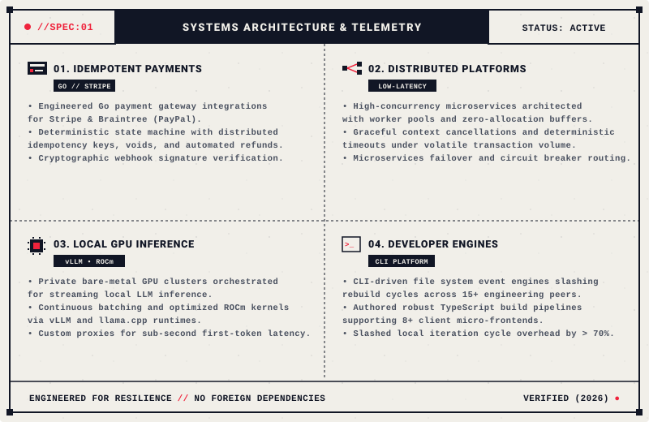

<div align="center">

  <!-- Editorial Dither-Art & Brutalist Print Poster (Dual Light/Dark Theme + Red Accents) -->
  <a href="https://jaspreetlabs.is-a.dev/">
    
  </a>

  <br /><br />

  <!-- Minimalist Brutalist Navigation Badges -->
  <p align="center">
    <a href="https://jaspreetlabs.is-a.dev/">
      
    </a>
    &nbsp;
    <a href="https://jaspreetlabs.is-a.dev/resume/">
      
    </a>
    &nbsp;
    <a href="https://www.linkedin.com/in/jaspreet-singh-71578a220/">
      
    </a>
  </p>

  <!-- Dither Divider with Red Beacon -->
  

</div>

<br />

<!-- Systems Architecture & Telemetry Spec Board (Replaces plain bullet points) -->
<div align="center">
  
</div>

<br />

<!-- Interactive Architectural Blueprints (Brutalist Toggles) -->
<details>
<summary><b>▶ [EXPAND ARCHITECTURAL BLUEPRINT // FINANCIAL IDEMPOTENCY &amp; REPLAY DEFENSE]</b></summary>
<br />

```text
┌──────────────────────────┐       ┌──────────────────────────┐       ┌──────────────────────────┐
│     CLIENT DISPATCH      │ ────> │  DISTRIBUTED LOCK (REDIS)│ ────> │    GO WORKER DAEMON      │
│  Idempotency-Key Header  │       │  Atomic Lock Acquisition │       │ Deterministic State Lock │
└──────────────────────────┘       └──────────────────────────┘       └────────────┬─────────────┘
                                                                                   │
                                   ┌──────────────────────────┐                    ▼
                                   │  MUTATION AUDIT LEDGER   │ <───── [EXECUTE / GATEWAY ACK]
                                   │  SHA-256 Webhook Log     │        Stripe & Braintree (PayPal)
                                   └──────────────────────────┘
```

#### Production Highlights:
- **Zero-Collision Transactions:** Distributed Redis mutexes prevent concurrent double-charge attempts during network timeouts.
- **Deterministic Replay Mitigation:** Keys cached with TTLs and cryptographic request fingerprints. Repeated payloads receive identical signed responses without re-executing business logic.
- **Asynchronous Webhook Ingestion:** Go worker pools verify webhook signatures asynchronously, pushing state transitions into MongoDB with exponential backoff retries.

</details>

<br />

<details>
<summary><b>▶ [EXPAND HARDWARE BLUEPRINT // BARE-METAL GPU LOCAL INFERENCE CLUSTERS]</b></summary>
<br />

```text
[BARE-METAL AMD GPU] ──> [ROCm KERNEL PIPELINES] ──> [vLLM ENGINE / PAGED KV-CACHE]
                                                                │
                                                                ▼
[SUB-SECOND STREAMING PROXY] <── [FASTAPI PROXY LAYER] <── [CONTINUOUS BATCHING]
```

#### Production Highlights:
- **Bare-Metal GPU Acceleration:** Configured high-throughput `vLLM` and `llama.cpp` inference environments with tuned ROCm execution kernels.
- **Low First-Token Latency:** Engineered custom asynchronous streaming proxies in Python/FastAPI that shave TTFT down for interactive developer workloads.
- **Local Microservice Isolation:** Orchestrated private inference runtimes inside Docker networks alongside Open WebUI for zero-leakage local AI pipelines.

</details>

<br />

<!-- Technical Capabilities Section Header -->
<div align="center">
  
</div>

<br />

```text
[//CAPABILITIES:01] CORE RUNTIMES & PROTOCOLS
                    > Go (Golang) • Node.js • TypeScript • Python • C++ • Bash • WebSockets

[//CAPABILITIES:02] PAYMENT LIFECYCLES & INTEGRATION
                    > Stripe API • Braintree (PayPal) • Idempotency Systems • Webhook Verification

[//CAPABILITIES:03] DATA PERSISTENCE & CACHING
                    > MongoDB (Aggregation Pipelines) • PostgreSQL • MySQL • Redis

[//CAPABILITIES:04] LOCAL INFERENCE & CLOUD PLATFORMS
                    > vLLM • llama.cpp • Docker & Compose • ROCm • Linux / Unix • Cloudflare Pages
```

<br />

<details>
<summary><b>▶ [EXPAND TELEMETRY MATRIX &amp; SYSTEM BENCHMARKS]</b></summary>
<br />

| Domain | Core Competencies | Production Verification |
| :--- | :--- | :--- |
| **Backend & Microservices** | Go, Node.js, Express.js, WebSockets, REST APIs | Worker pool fan-outs with zero-allocation buffering |
| **Financial Engineering** | Stripe API, Braintree SDK, Webhook Ingestion | Deterministic idempotency state machines & automated reconciliation |
| **Database Architecture** | MongoDB Aggregations, PostgreSQL, MySQL, Redis | Dynamic schema normalization & query planner optimization |
| **Local AI Inference** | vLLM, llama.cpp, ROCm, Docker Compose | Streaming sub-second first-token response pipelines |
| **Developer Productivity** | TypeScript Pipelines, CLI daemons, Chokidar | 70% reduction in local rebuild iteration cycles |

</details>

<br />

<!-- Featured Projects Section Header -->
<div align="center">
  
</div>

<br />

<table>
  <tr>
    <td width="50%" valign="top">
      <h4>01 // BONDS INDIA ANALYTICS</h4>
      <p>
        <a href="https://bondsindia-production.up.railway.app/">
          
        </a>
      </p>
      <p>Enterprise-grade financial analytics engine tracking corporate debt securities across NSE &amp; BSE.</p>
      <ul>
        <li>Metadata-driven architecture with dynamic schema normalization.</li>
        <li>Aggregated query pipelines for real-time risk, yield, and tenure metrics.</li>
        <li>Multi-stage Docker containerization with automated zero-downtime deployment.</li>
      </ul>
      <p><b>Stack:</b> <code>React 19</code> <code>TypeScript</code> <code>Node.js</code> <code>MongoDB</code></p>
    </td>
    <td width="50%" valign="top">
      <h4>02 // LOCAL GPU INFERENCE CLUSTER</h4>
      <p>
        
      </p>
      <p>Private GPU-accelerated local inference cluster engineered on bare-metal AMD hardware.</p>
      <ul>
        <li>High-throughput <code>vLLM</code> and <code>llama.cpp</code> inference pipelines.</li>
        <li>Microservices orchestration via Docker Compose and Open WebUI.</li>
        <li>Custom streaming API proxies for sub-second first-token latency optimization.</li>
      </ul>
      <p><b>Stack:</b> <code>vLLM</code> <code>llama.cpp</code> <code>Docker</code> <code>ROCm</code> <code>Python</code></p>
    </td>
  </tr>
  <tr>
    <td width="50%" valign="top">
      <h4>03 // TERMINAL HOT-RELOAD DEV ENGINE</h4>
      <p>
        
      </p>
      <p>Terminal-first developer productivity engine replacing heavy UI synchronization workflows.</p>
      <ul>
        <li>WebSocket-based incremental file system watcher with Chokidar.</li>
        <li>Eliminated redundant full-project rebuilds across 15+ engineering peers.</li>
        <li>Slashed local iteration cycle overhead by over 70%.</li>
      </ul>
      <p><b>Stack:</b> <code>Node.js</code> <code>Commander.js</code> <code>WebSockets</code> <code>TypeScript</code></p>
    </td>
    <td width="50%" valign="top">
      <h4>04 // UNIVERSAL DATABASE OPERATIONS SUITE</h4>
      <p>
        
      </p>
      <p>Database-agnostic operations cockpit handling complex cross-database administration.</p>
      <ul>
        <li>50+ dynamic operations across MongoDB collections &amp; SQL tables.</li>
        <li>Virtual table virtualization for zero-latency 10k+ row data inspections.</li>
        <li>Role-based operational safety checks preventing accidental data mutation.</li>
      </ul>
      <p><b>Stack:</b> <code>React</code> <code>TanStack Table</code> <code>Shadcn UI</code> <code>Express</code></p>
    </td>
  </tr>
</table>

<br />

<!-- Dither Divider -->
<div align="center">
  
</div>

<br />

### 📬 Direct Dispatch & Communications

<div align="center">

  <p>Available for backend systems engineering, distributed payment lifecycles, and high-performance developer tooling.</p>

  <p>
    <a href="https://jaspreetlabs.is-a.dev/">
      
    </a>
    &nbsp;
    <a href="https://www.linkedin.com/in/jaspreet-singh-71578a220/">
      
    </a>
    &nbsp;
    <a href="mailto:jaspreet.singh.tech@gmail.com">
      
    </a>
  </p>

  <br />

  <!-- Dither Divider -->
  

</div>
