<div align="center">

  <!-- Dual-Mode Retro Developer Workstation (Automatic Dark/Light Mode) -->
  <picture>
    <source media="(prefers-color-scheme: dark)" srcset="./assets/retro-window-dark.svg">
    <source media="(prefers-color-scheme: light)" srcset="./assets/retro-window-light.svg">
    
  </picture>

  <br />

  <!-- Retro High-Contrast Action Buttons -->
  <p align="center">
    <a href="https://jaspreetlabs.is-a.dev/">
      
    </a>
    &nbsp;
    <a href="https://jaspreetlabs.is-a.dev/resume/">
      
    </a>
    &nbsp;
    <a href="https://www.linkedin.com/in/jaspreet-singh-71578a220/">
      
    </a>
    &nbsp;
    <a href="mailto:jaspreet.singh.tech@gmail.com">
      
    </a>
  </p>

</div>

<br />

## ⚡ Who I Am & What I Build

I am a **Backend & Distributed Systems Engineer** with **3+ years of production experience** specializing in high-concurrency payment lifecycles, Go microservices, and developer platforms. I focus on deterministic state machines, low-latency API design, and resilient backend architectures.

- 🏢 **Current Experience:** Backend / Full Stack Engineer at **Protokol.io (Native Teams)** (2024 – Present).
- 💳 **Financial Systems:** Engineered end-to-end payment gateway integrations in **Go** for **Stripe** and **Braintree (PayPal)**, including automated refunds, voids, idempotent state machines, and cryptographic webhook verification.
- 🧠 **Local AI Clusters:** Architecting and maintaining private GPU-accelerated local inference clusters (**vLLM**, **llama.cpp**, **ROCm**) on bare-metal hardware for zero-latency streaming AI workflows.
- ⚡ **Developer Platforms:** Built CLI-driven hot reload engines using **Node.js & WebSockets** that eliminated rebuild bottlenecks across 15+ engineering peers.
- 📦 **SDKs & Micro-Frontends:** Authored and maintained production TypeScript build pipelines supporting 8+ client micro-frontends with zero regression.

<br />

---

## 🛠️ Technical Stack & Tools I Use

<div align="center">

  <!-- Visual Tech Stack Icon Matrix -->
  <a href="https://skillicons.dev">
    
  </a>

</div>

<br />

```text
[01] CORE LANGUAGES       : Go (Golang) • Node.js • TypeScript • JavaScript • Python • C++ • Bash
[02] FINANCIAL ENGINES    : Stripe API • Braintree (PayPal) • Idempotency Systems • Webhook Security
[03] DATA PERSISTENCE     : MongoDB (Aggregation Pipelines) • PostgreSQL • MySQL • Redis Cache
[04] LOCAL AI & INFERENCE : vLLM • llama.cpp • Docker & Compose • ROCm • Linux / Unix Runtimes
[05] CLOUD & DEVOPS       : AWS • Cloudflare Pages • Docker Compose • Git • CI/CD Pipelines
```

<br />

---

## 🚀 Featured Production Systems

<table>
  <tr>
    <td width="50%" valign="top">
      <h3 align="center">📈 Bonds India Analytics Engine</h3>
      <p align="center">
        <a href="https://bondsindia-production.up.railway.app/">
          
        </a>
      </p>
      <p>Full-scale financial analytics platform tracking and querying corporate bond securities across NSE &amp; BSE.</p>
      <ul>
        <li><b>Metadata-driven architecture:</b> Dynamic schema normalization across fluctuating market sources.</li>
        <li><b>Aggregated query pipelines:</b> Real-time computation of bond yields, tenure risks, and credit ratings.</li>
        <li><b>Zero-downtime deployment:</b> Multi-stage Docker containerization on Railway.</li>
      </ul>
      <p><b>Stack:</b> <code>React 19</code> <code>TypeScript</code> <code>Node.js</code> <code>MongoDB</code> <code>TanStack</code></p>
    </td>
    <td width="50%" valign="top">
      <h3 align="center">🧠 Bare-Metal Local GPU Inference</h3>
      <p align="center">
        
      </p>
      <p>Private GPU-accelerated local inference cluster engineered on bare-metal AMD hardware.</p>
      <ul>
        <li><b>High-throughput runtimes:</b> Orchestrated <code>vLLM</code> continuous batching and <code>llama.cpp</code> ROCm kernels.</li>
        <li><b>Low TTFT streaming:</b> Engineered custom streaming API proxies for sub-second first-token latency.</li>
        <li><b>Local isolation:</b> Docker Compose microservice mesh alongside Open WebUI.</li>
      </ul>
      <p><b>Stack:</b> <code>vLLM</code> <code>llama.cpp</code> <code>Docker</code> <code>ROCm</code> <code>Python</code></p>
    </td>
  </tr>
  <tr>
    <td width="50%" valign="top">
      <h3 align="center">⚡ CLI Hot-Reload Dev Engine</h3>
      <p align="center">
        
      </p>
      <p>Terminal-first developer productivity engine replacing heavy UI synchronization workflows.</p>
      <ul>
        <li><b>Event-driven file watcher:</b> WebSocket-based incremental dispatch with Chokidar.</li>
        <li><b>Massive team speedup:</b> Slashed local rebuild iteration cycles by &gt; 70% across 15+ engineers.</li>
        <li><b>Streamlined CLI:</b> Intuitive flag architecture with Commander.js and TypeScript.</li>
      </ul>
      <p><b>Stack:</b> <code>Node.js</code> <code>Commander.js</code> <code>WebSockets</code> <code>TypeScript</code></p>
    </td>
    <td width="50%" valign="top">
      <h3 align="center">🗄️ Universal Database Admin Suite</h3>
      <p align="center">
        
      </p>
      <p>Database-agnostic operations cockpit handling complex cross-database queries and maintenance.</p>
      <ul>
        <li><b>Multi-engine support:</b> 50+ pre-built operations across MongoDB collections &amp; SQL tables.</li>
        <li><b>Zero-latency inspection:</b> Virtualized 10k+ row inspections with TanStack Table.</li>
        <li><b>Mutation safety:</b> Guarded operational transaction confirmation layers.</li>
      </ul>
      <p><b>Stack:</b> <code>React</code> <code>TanStack Table</code> <code>Shadcn UI</code> <code>Express</code></p>
    </td>
  </tr>
</table>

<br />

---

## 🔍 Interactive Technical Deep-Dives

<details>
<summary><b>▶ [cat /etc/payment_idempotency_spec.md — Click to view Architecture Blueprint]</b></summary>
<br />

```text
┌──────────────────────────┐       ┌──────────────────────────┐       ┌──────────────────────────┐
│     CLIENT DISPATCH      │ ────> │  DISTRIBUTED LOCK (REDIS)│ ────> │    GO WORKER DAEMON      │
│  Idempotency-Key Header  │       │  Atomic Lock Acquisition │       │ Deterministic State Lock │
└──────────────────────────┘       └──────────────────────────┘       └────────────┬─────────────┘
                                                                                   │
                                   ┌──────────────────────────┐                    ▼
                                   │  MUTATION AUDIT LEDGER   │ <───── [EXECUTE / GATEWAY ACK]
                                   │  SHA-256 Webhook Log     │        Stripe & Braintree (PayPal)
                                   └──────────────────────────┘
```

#### Key Engineering Safeguards:
- **Zero-Collision Transactions:** Distributed Redis mutexes prevent concurrent double-charge attempts during network timeouts.
- **Deterministic Replay Mitigation:** Keys cached with TTLs and cryptographic request fingerprints. Repeated payloads receive identical signed responses without re-executing business logic.
- **Asynchronous Webhook Ingestion:** Go worker pools verify webhook signatures asynchronously, pushing state transitions into MongoDB with exponential backoff retries.

</details>

<br />

<details>
<summary><b>▶ [cat /etc/competencies_matrix.log — Click to view Full Production Breakdown]</b></summary>
<br />

| Domain | Core Competencies | Production Verification |
| :--- | :--- | :--- |
| **Backend & Microservices** | Go, Node.js, Express.js, WebSockets, REST APIs | Worker pool fan-outs with zero-allocation buffering |
| **Financial Engineering** | Stripe API, Braintree SDK, Webhook Ingestion | Deterministic idempotency state machines & automated reconciliation |
| **Database Architecture** | MongoDB Aggregations, PostgreSQL, MySQL, Redis | Dynamic schema normalization & query planner optimization |
| **Local AI Inference** | vLLM, llama.cpp, ROCm, Docker Compose | Streaming sub-second first-token response pipelines |
| **Developer Productivity** | TypeScript Pipelines, CLI daemons, Chokidar | 70% reduction in local rebuild iteration cycles |

</details>

<br />

---

## 📬 Direct Communications & Connect

<div align="center">

  <p>Available for backend systems engineering, distributed payment lifecycles, and high-performance developer tooling.</p>

  <p>
    <a href="https://jaspreetlabs.is-a.dev/">
      
    </a>
    &nbsp;
    <a href="https://www.linkedin.com/in/jaspreet-singh-71578a220/">
      
    </a>
    &nbsp;
    <a href="mailto:jaspreet.singh.tech@gmail.com">
      
    </a>
  </p>

  <br />

  <sub>&copy; 2026 Jaspreet Singh &bull; Hosted on GitHub &bull; Systems Active</sub>

</div>
