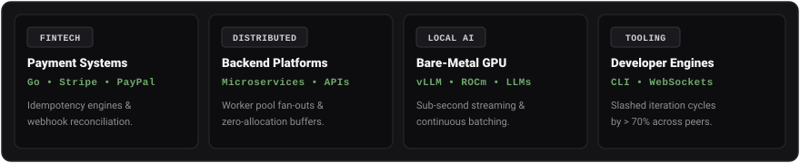
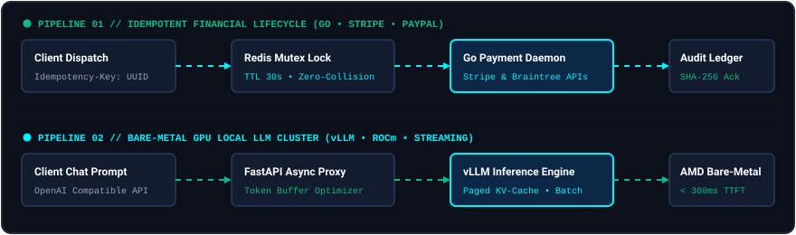

<div align="center">

  <!-- Dynamic Typing Banner (Chalk White) -->
  <a href="https://jaspreetlabs.is-a.dev/">
    
  </a>

  <!-- Modern Workstation Hero Card (Palette from uploaded reference images) -->
  

  <br />

  <!-- Action Badges (Matte Graphite & Warm Platinum) -->
  <p align="center">
    <a href="https://jaspreetlabs.is-a.dev/">
      
    </a>
    &nbsp;
    <a href="https://jaspreetlabs.is-a.dev/resume/">
      
    </a>
    &nbsp;
    <a href="https://www.linkedin.com/in/jaspreet-singh-71578a220/">
      
    </a>
    &nbsp;
    <a href="mailto:jaspreet.singh.tech@gmail.com">
      
    </a>
  </p>

</div>

<br />

### ⚡ Core Engineering Pillars

<div align="center">
  <!-- Visual 4-Pillar Infographic Dashboard -->
  
</div>

<br />

### 🛰️ Live Architecture Pipelines

<div align="center">
  <!-- Visual End-to-End Architecture Pipelines -->
  
</div>

<br />

---

### 🛠️ Technical Arsenal & Tools

<div align="center">

  <!-- Visual Tech Stack Icon Matrix -->
  <a href="https://skillicons.dev">
    
  </a>

</div>

<br />

---

### 🚀 Production Systems & Projects

<table>
  <tr>
    <td width="50%" valign="top">
      <h4>📈 Bonds India Analytics Engine</h4>
      <p>
        <a href="https://bondsindia-production.up.railway.app/">
          
        </a>
      </p>
      <p><b>Real-time corporate debt analytics across NSE &amp; BSE.</b> Aggregated query pipelines computing risk metrics and yield curves with dynamic schema normalization.</p>
      <p><code>React 19</code> <code>TypeScript</code> <code>Node.js</code> <code>MongoDB</code> <code>Docker</code></p>
    </td>
    <td width="50%" valign="top">
      <h4>🧠 Bare-Metal Local GPU Inference</h4>
      <p>
        
      </p>
      <p><b>Private local AI cluster with sub-second streaming inference.</b> Continuous batching on AMD ROCm with custom FastAPI streaming proxies for minimum TTFT.</p>
      <p><code>vLLM</code> <code>llama.cpp</code> <code>Docker</code> <code>ROCm</code> <code>Python</code></p>
    </td>
  </tr>
  <tr>
    <td width="50%" valign="top">
      <h4>⚡ CLI Hot-Reload Dev Engine</h4>
      <p>
        
      </p>
      <p><b>Terminal-first file watcher slashing rebuild cycles by &gt; 70%.</b> WebSocket-based incremental dispatch engine replacing heavy sync bottlenecks across 15+ engineers.</p>
      <p><code>Node.js</code> <code>Commander.js</code> <code>WebSockets</code> <code>TypeScript</code></p>
    </td>
    <td width="50%" valign="top">
      <h4>🗄️ Universal Database Admin Suite</h4>
      <p>
        
      </p>
      <p><b>Database-agnostic operations cockpit handling 10k+ virtualized rows.</b> 50+ pre-built dynamic queries across MongoDB and SQL with mutation safety guards.</p>
      <p><code>React</code> <code>TanStack Table</code> <code>Shadcn UI</code> <code>Express</code></p>
    </td>
  </tr>
</table>

<br />

---

### 🔍 Interactive Terminal Diagnostics

<details>
<summary><b>▶ [ ./run_diagnostics.sh --show-architecture ]</b></summary>
<br />

```text
┌──────────────────────────┐       ┌──────────────────────────┐       ┌──────────────────────────┐
│     CLIENT DISPATCH      │ ────> │  DISTRIBUTED LOCK (REDIS)│ ────> │    GO WORKER DAEMON      │
│  Idempotency-Key Header  │       │  Atomic Lock Acquisition │       │ Deterministic State Lock │
└──────────────────────────┘       └──────────────────────────┘       └────────────┬─────────────┘
                                                                                   │
                                   ┌──────────────────────────┐                    ▼
                                   │  MUTATION AUDIT LEDGER   │ <───── [EXECUTE / GATEWAY ACK]
                                   │  SHA-256 Webhook Log     │        Stripe & Braintree (PayPal)
                                   └──────────────────────────┘
```

#### Key Architecture Safeguards:
- **Zero-Collision Transactions:** Distributed Redis mutexes prevent concurrent double-charge attempts during network timeouts.
- **Deterministic Replay Mitigation:** Keys cached with TTLs and cryptographic request fingerprints. Repeated payloads receive identical signed responses without re-executing business logic.
- **Asynchronous Webhook Ingestion:** Go worker pools verify webhook signatures asynchronously, pushing state transitions into MongoDB with exponential backoff retries.

</details>

<br />

---

### 📬 Direct Dispatch & Connect

<div align="center">

  <p>Available for backend systems engineering, distributed payment lifecycles, and high-performance developer tooling.</p>

  <p>
    <a href="https://jaspreetlabs.is-a.dev/">
      
    </a>
    &nbsp;
    <a href="https://www.linkedin.com/in/jaspreet-singh-71578a220/">
      
    </a>
    &nbsp;
    <a href="mailto:jaspreet.singh.tech@gmail.com">
      
    </a>
  </p>

  <br />

  <sub>&copy; 2026 Jaspreet Singh &bull; Hosted on GitHub &bull; Workstation Active</sub>

</div>
