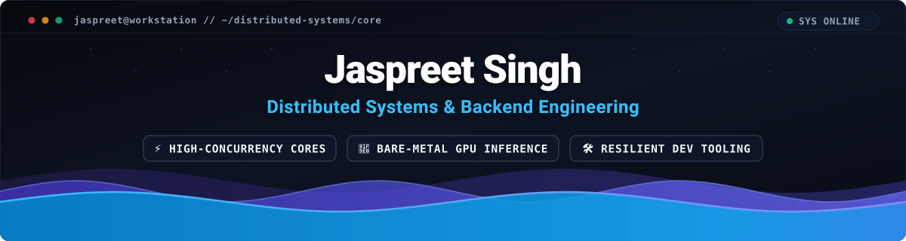
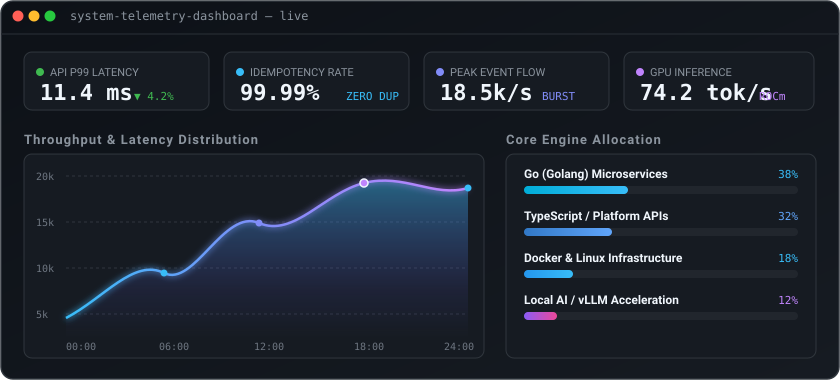

  <!-- Layered Gradient Wave Header Banner -->
  

  <!-- Dynamic Typing Subtitle Animation -->
  

   

  <!-- Premium Interactive Action Links -->
  

    
    &nbsp;
    
    &nbsp;
    
  

  <!-- Waving Gradient Wave Divider -->
  

 

### ⚡ About Me & Engineering Mindset

I'm a backend and systems engineer fascinated by how complex software behaves under real concurrency and high transaction volume. My focus is on distributed architecture, low-latency API design, and building resilient microservices that fail predictably and recover seamlessly.

When I'm not architecting payment webhooks or tuning database query plans, you'll find me running private local LLM clusters on bare-metal GPUs, engineering terminal developer tools, or exploring distributed consensus protocols.

- 🔭 **What I build:** High-throughput backend services, deterministic transaction lifecycles, and developer platforms.
- 🧠 **Current rabbit hole:** Running private local LLMs with GPU acceleration (`vLLM`, `llama.cpp`) and streaming agent architectures.
- ⚡ **Core philosophy:** Make systems fast, make failure states predictable, and automate anything you do more than twice.
- 💬 **Ask me about:** Concurrency edge cases, payment idempotency, Go microservices, and local GPU setups.

 

---

### 📊 System Telemetry & Architecture Dashboard

  

 

---

### 🛠️ Technical Arsenal

  <!-- Unified Dark Skill Icons Grid -->
  

 

<b>🔍 Core Competencies & Architecture Breakdown</b>

 

| Domain | Core Technologies |
| :--- | :--- |
| **Backend & Systems** | Go (Golang), Node.js, Express.js, WebSockets, RESTful APIs, Microservices, Worker Daemons |
| **Payment Engineering** | Stripe API, Braintree (PayPal) SDK, Idempotent Transaction Lifecycle, Webhook Reconciliations |
| **Databases & Caching** | MongoDB (Aggregation Pipelines), MySQL, PostgreSQL, Redis |
| **Frontend & UI** | React 19, TypeScript, TanStack Query/Table/Router, Tailwind CSS, Shadcn UI |
| **DevOps & Infrastructure** | Docker, Docker Compose, Linux/Unix Environments, Cloudflare Pages, Git, CI/CD |

 

<!-- Wave Section Divider -->

 

### 💼 Featured Systems & Passion Builds

<table>
  <tr>
    <td width="50%" valign="top">
      <h3 align="center">📈 Bonds India Analytics</h3>
      

        
      

      
Full-scale analytics engine tracking and querying corporate bonds across NSE & BSE.

      <ul>
        <li>Metadata-driven architecture with dynamic schema normalization.</li>
        <li>Aggregated query pipelines for real-time risk, yield, and tenure metrics.</li>
        <li>Containerized multi-stage Docker build with zero-downtime deployment.</li>
      </ul>
      
<b>Stack:</b> <code>React 19</code> <code>TypeScript</code> <code>Node.js</code> <code>MongoDB</code> <code>TanStack</code>

    </td>
    <td width="50%" valign="top">
      <h3 align="center">🧠 Local LLM Inference Cluster</h3>
      

        
      

      
Private GPU-accelerated local inference cluster built on bare-metal AMD hardware.

      <ul>
        <li>Configured high-throughput vLLM & llama.cpp inference pipelines.</li>
        <li>Microservices orchestration via Docker Compose and Open WebUI.</li>
        <li>Custom API proxies for streaming response latency optimization.</li>
      </ul>
      
<b>Stack:</b> <code>vLLM</code> <code>llama.cpp</code> <code>Docker</code> <code>Open WebUI</code> <code>ROCm</code>

    </td>
  </tr>
  <tr>
    <td width="50%" valign="top">
      <h3 align="center">⚡ Hot-Reload Dev Engine</h3>
      

        
      

      
Terminal-first developer productivity engine replacing UI-heavy sync workflows.

      <ul>
        <li>WebSocket-based incremental file system watcher with Chokidar.</li>
        <li>Eliminated redundant full-project rebuilds for 15+ engineering peers.</li>
      </ul>
      
<b>Stack:</b> <code>Node.js</code> <code>Commander.js</code> <code>WebSockets</code> <code>TypeScript</code>

    </td>
    <td width="50%" valign="top">
      <h3 align="center">🗄️ Universal Database Admin Suite</h3>
      

        
      

      
Database-agnostic operations cockpit handling complex cross-database administration.

      <ul>
        <li>50+ pre-built dynamic operations across MongoDB collections & MySQL tables.</li>
        <li>Virtual table virtualization for zero-latency 10k+ row inspections.</li>
      </ul>
      
<b>Stack:</b> <code>React</code> <code>TanStack Table</code> <code>Shadcn UI</code> <code>Express</code>

    </td>
  </tr>
</table>

 

### 📬 Let's Connect

  
Whether you want to discuss distributed backend systems, local AI pipelines, or explore collaboration:

  

    
    &nbsp;
    
    &nbsp;
    
  

   

  <!-- Closing Gradient Wave Footer Banner -->
  

